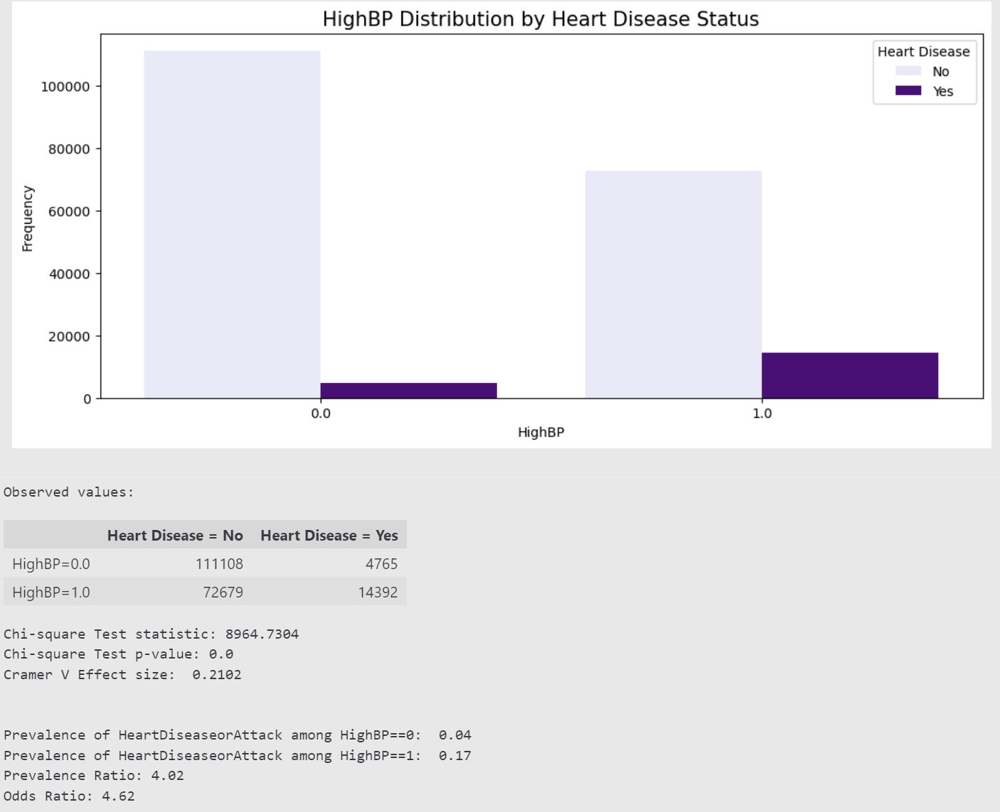

# Unraveling the Tangled Threads: A Guide to Confounding in Research

## Confounding Variables: The Hidden Influencers

Dive into the realm of data analysis, where the quest to discern the impact of one variable upon another or to pinpoint the optimal algorithm for predictive modeling is paramount. Yet, in this intricate dance of numbers and patterns, confounding variables often play the role of the unseen puppeteers. These are the cryptic elements that weave complexity into seemingly straightforward relationships, casting shadows of doubt across the stage of empirical inquiry.

Imagine you're trying to link a specific diet to weight loss, but you haven't accounted for exercise—a classic confounder. It's like trying to listen to a solo instrument while a full orchestra plays in the background. Confounding variables can influence the outcome of an experiment in many ways, such as:

* Forge invalid correlations, leading us down a path of illusion.
* Inflate variance, adding noise and chaos to our data symphony.
* Introduce bias, tilting the scales and distorting reality.

These variables might be known entities, or they might be stealthy intruders, escaping detection while they mingle and merge with the variables we're studying. They're characterized by their association with both independent and dependent variables, affecting different groups in varied ways. The real trick is that their effects are often hidden, evading detection without a deliberate design to expose them.


Note: picture created by DALL-E3, prompt: "solo violinist in the spotlight with a full, yet obscured, orchestra in the background, 16:9, high resolution, cinematic quality". It depicts the challenge of isolating the effect of an independent variable (the solo violinist) amidst the noise and chaos of confounding variables (the blurred orchestra) in the background.

This blog will navigate through the challenges posed by confounders in statistics and ML, and how traditional and modern methods have sought to reveal and mitigate their deceptive effects.

## Identifying Confounders

In the realm of statistics, confounding variables have long been the bane of researchers. These are the hidden variables that, if left unchecked, can introduce spurious associations, leading to erroneous conclusions. Again, with the example of diet and weight loss, pinpointing the influence of a specific diet on weight loss might seem straightforward. However, exercise independently affects weight loss, and it's likely correlated with dietary habits. Individuals who adhere to a specific diet regimen may also be more inclined to engage in regular physical activity. This dual relationship means that any observed correlation between diet and weight loss could be misleading. Without considering exercise, one might falsely attribute the full effect of weight loss to diet alone, when in fact, it could be significantly influenced by physical activity levels.

For illustrative purposes, consider $X$ as the dietary regimen, $Y$ as the magnitude of weight loss, and $Z$ as the frequency of exercise. The interplay between diet ($X$) and weight loss ($Y$) may be obfuscated by exercise ($Z$), given that $Z$ impacts both $X$ and $Y$. The crux of the problem manifests when attempting to discern the effect of diet on weight loss without considering the variable of exercise. The probability of weight loss ($Y$) given a specific diet $X$, ignoring exercise, is expressed as $P(Y∣X)$. Nonetheless, this fails to capture the confounding effect of exercise ($Z$). The objective is to estimate $P(Y∣do(X))$, which delineates the probability of weight loss given that an intervention has been applied to specify the diet to $X$, simulating a controlled experiment. In an ideal scenario where $X$ and $Y$ are not confounded, the following condition holds:

$P(Y∣do(X))=P(Y∣X)$

This equation implies that directly observing the effect of diet on weight loss—as if in a controlled environment where the diet is assigned randomly—should coincide with the association observed in a non-experimental context, absent of confounding influences. Regrettably, such ideal circumstances are uncommon, and confounding variables like exercise ($Z$) necessitate consideration. The adjustment formula is employed to estimate the causal effect of diet on weight loss while controlling for exercise:

$P(Y∣do(X))=\sum_{z} P(Y∣X,Z=z)P(Z=z)$

This adjustment formula integrates the probabilities of weight loss across each level of exercise, each weighted by the probability of that level of exercise occurring. By applying this adjusted estimate, the effect of diet on weight loss can be isolated, theoretically excluding the confounding influence of exercise.

The depicted diagrams in Figure 1 distill the essence of confounding in statistical analysis, where in Fig 1a, $Z$ represents a confounding variable that impacts both the independent variable X and the dependent variable Y, as illustrated by the respective f and c pathways. The inequality $P(X | Z) \neq P(X)$ signals that the probability of $X$ is contingent upon knowledge of $Z$, denoting an association between the two. Concurrently, $P(Y∣do(X)) \neq P(Y∣X)$ indicates that the association between X and Y observed is not purely a consequence of $X$'s influence on $Y$, but rather is muddled by $Z$'s confounding presence, necessitating adjustment to unearth the true causal effect of $X$ on $Y$. Transitioning to Fig 1b, the scenario is reimagined with $Z$'s influence on $X$ being controlled for, which is symbolized by the absence of a connecting arrow. Here, $P(X | Z) = P(X)$ asserts that X's occurrence is unaffected by $Z$ upon adjustment, and $P(Y∣do(X))=P(Y∣X)$ posits that the observed effect of $X$ on $Y$ mirrors the effect that would be observed under experimental intervention on X. This denotes an unconfounded causal relationship, which is the crux of statistical endeavors to discern the direct impact of independent variables on outcomes, devoid of confounding variables' distortion.


Note: author's elaboration using [Overleaf](https://www.overleaf.com/project/660f8679664e7ff195fdbaf9/invite/token/bf537021b2fd5e51bf608905806dbc823a9abdabcac09bc5?project_name=Confounding&user_first_name=Doris). The two diagrams present two scenarios (1) a confounded relationship where exercise ($Z$) affects both diet ($X$) and weight loss ($Z$), illustrated in Fig 1a; and (2) an unconfounded relationship where the effect of diet ($X$) on weight loss ($Y$) isolated from the exercise variable ($Z$), dispicted in Fig 1b.

## Confounding Detection and Impact Quantification

Detecting confounding variables is a critical step in ensuring the validity of statistical analyses. A variety of tools and techniques are at the disposal of researchers to identify potential confounders. Directed Acyclic Graphs (DAGs) are visual representations that help in understanding the relationship between variables and in spotting potential confounding paths, as shown in the previous section. Moreover, correlation matrices can be useful in preliminary detection by highlighting variables that are correlated with both the treatment and the outcome.

More sophisticated statistical methods include regression analysis, where significant changes in coefficient estimates upon adding new variables may suggest confounding. Factor analysis and principal component analysis are also employed to uncover latent variables that could potentially be confounders. Lastly, sensitivity analysis is a powerful tool that assesses how robust the results are to potential unmeasured confounding.

Once confounding is detected, it is essential to quantify its impact. The confounding effect can be measured as the difference between estimates obtained from models with and without the confounder included. In regression models, this is often done by comparing the adjusted and unadjusted coefficients for the variable of interest.

Another approach is the use of counterfactual frameworks, such as potential outcomes or causal diagrams, which allow for the estimation of what the relationship between the independent and dependent variables would be in the absence of the confounder. These methods often involve complex statistical techniques such as structural equation modeling or instrumental variable analysis.

This section will walk through a real-world example in medical research, examining the risk factors of heart disease based on statstitical tests, such as Chi-Square Test and Cramer's V effect size, and measuring the impact of confounding based on prevelence ratio and odds raio. High blood pressure (BP) is one such risk factor that has been consistently correlated with heightened susceptibility to heart disease. However, the simplicity of this correlation belies the complexity of underlying interactions, particularly with confounding variables such as smoking habits. Smoking, with its notorious reputation for precipitating a multitude of cardiovascular issues, stands as a pivotal confounder. It independently increases the risk of both high blood pressure and heart disease, potentially muddying the waters of their direct relationship.

```
# load the dataset
data = pd.read_csv('data/heart_disease_health_indicators_BRFSS2015.csv')

# check the dimension of the dataset
num_records, num_columns = data.shape
print('The dataset contains {} of records and {} of columns.'.format(num_records, num_columns))

# check the attributes in the dataset
print('Attributes in the dataset: ', data.columns.values)

# view the first 5 rows of the dataset
pd.set_option('display.max_columns', 30)
data.head()
```

```
# split the dataset into training and test set
from sklearn.model_selection import train_test_split

train, test = train_test_split(data, test_size=0.2, random_state=122)

# check the dimension of the train and test datasets
print('Dimension of training dataset: ', train.shape)
print('Dimension of test dataset: ', test.shape)
```

```
# distribution of the classes in training dataset
targets = train.HeartDiseaseorAttack.value_counts()
colors = ['lavender','indigo']

# visualization
figure, axes = plt.subplots(1,2, figsize=(15,5), gridspec_kw={'width_ratios':[1.5,1]})
axes[0].barh(y=targets.index, width=targets.values, color=colors)
axes[0].set_xlabel('Frequency')
axes[0].set_ylabel('Heart Diseases')
axes[0].set_yticks([0,1], ['No','Yes'])
axes[0].grid(alpha=0.4)

for index, values in enumerate(targets):
    axes[0].text(values+1000, index, str(values), va='center')
  
axes[1].pie(targets.values, labels=['No','Yes'], autopct='%.2f%%', explode=([0.05]*len(targets.index)), colors=colors)

figure.suptitle('Distribution of Samples: Healthy vs Heart Disease', fontsize=15)
plt.tight_layout(pad=1)
plt.show()
```


output 1

### Association between High Blood Pressure and Heart Diseases

#### Question: Is there a statistically significant association between high blood pressure and the likelihood of heart diseases?

- Null Hypothesis (H0): There is no significant association between high blood pressure and the likelihood of heart diseases.
- Alternative Hypothesis (H1): There is a significant association between high blood pressure and the likelihood of heart diseases.

```
# helper function to perform Chi-square test
from scipy.stats.contingency import chi2_contingency, association

def chi2test_and_ratios(feature, outcome, featName, outcomeName, data):
    unique_values = np.sort(data[feature].unique())

    # Visualization
    plt.figure(figsize=(12, 5))
    ax = sns.countplot(data=data, x=feature, hue=outcome, order=unique_values, palette=['lavender', 'indigo'])
    plt.xlabel(featName)
    plt.ylabel('Frequency')
    plt.title(f'{featName} Distribution by {outcomeName} Status', fontsize=15)
    ax.legend(title=outcomeName, labels=['No', 'Yes'])
    plt.show()

    # Crosstab to calculate observed values for Chi-square test
    contingency_table = pd.crosstab(data[feature], data[outcome])
    lst = [f'{featName}={val}' for val in unique_values]
    contingency_table.index = lst
    contingency_table.columns = [f'{outcomeName} = No', f'{outcomeName} = Yes']
    print('Observed values:')
    display(contingency_table)

    # Perform chi-square test
    chi2, p_value, _, _ = chi2_contingency(contingency_table)

    # compute the effect size (Cramer's V)
    effect_size = round(association(contingency_table, method='cramer'), 4)

    # Calculate Prevalence Ratio
    p0 = contingency_table.iloc[0, 1] / contingency_table.iloc[0].sum()
    p1 = contingency_table.iloc[1, 1] / contingency_table.iloc[1].sum()
    prevalence_ratio = p1 / p0

    # Calculate Odds Ratio
    odds_ratio = (contingency_table.iloc[1, 1] * contingency_table.iloc[0, 0]) / (contingency_table.iloc[1, 0] * contingency_table.iloc[0, 1])

    # Print the test result
    print('Chi-square Test statistic:', round(chi2, 4))
    print('Chi-square Test p-value:', round(p_value, 4))
    print('Cramer V Effect size: ', effect_size)
    print('\n')
    print(f'Prevalence of {outcome} among {feature}==0: ', round(p0, 2))
    print(f'Prevalence of {outcome} among {feature}==1: ', round(p1, 2))
    print('Prevalence Ratio:', round(prevalence_ratio, 2))
    print('Odds Ratio:', round(odds_ratio, 2))
```

call the function

```
chi2test_and_ratios('HighBP', 'HeartDiseaseorAttack', 'HighBP', 'Heart Disease', train)
```


output2

The chi-square test was employed to scrutinize the association between high blood pressure and the likelihood of heart diseases. The obtained p-value falls below the significance threshold (alpha=0.05), prompting the rejection of the null hypothesis. This implies a statistically significant association between high blood pressure and the likelihood of heart diseases in the analyzed dataset. The effect size, as gauged by Cramer's V, was computed to be 0.2102, indicating a moderate effect size. This suggests a noteworthy association between high blood pressure and heart diseases that cannot be overlooked.

The prevalence of coronary heart disease among people without high blood pressure is 4765 divided by 111108, or 4% of all people with diabetes have coronary heart disease. Similarly the prevalence among those with high blood pressure is 17%. The prevalence ratio, considering whether high blood pressure is a risk factor for coronary heart disease is 17 / 4 = 4.02. The prevalence of coronary heart disease in people with high blood pressure is 4 times as great as it is in people without high blood pressure.

The odds of having high blood pressure among those with coronary heart disease is 4.62 times as high as the odds of having high blood pressure among those who do not have coronary heart disease.

### Consider Smoking Habit as a Potential Confounder

#### Question: Is smoking habit  a risk factor for CHD (among people without high blood pressure?

First of all, prior knowledge tells us that smoking habit is related to many heart related diseases. Prior knowledge is an important first step but let's test this with data.

```
# among people without high blood pressure
# Filter the training data for HighBP == 0
train_no_highbp = train[train['HighBP'] == 0]

# Call the chi2test_and_ratios function for Smoker vs HeartDiseaseorAttack for the subset of data
chi2test_and_ratios('Smoker', 'HeartDiseaseorAttack', 'Smoker', 'Heart Disease', train_no_highbp)
```


output 3

**For people without high blood pressure**, the chi-square analysis has revealed a compelling link between smoking status and heart disease incidence. The chi-square test statistic stands at a strikingly high value of 987.6092, coupled with a p-value of 0.0, which decisively indicates a statistically significant association; the null hypothesis of no association is firmly rejected. The Cramer's V value of 0.0924, while suggesting a relatively small effect size, still confirms that the relationship is statistically meaningful.

The observed prevalence of heart disease in non-smokers (Smoker=0.0) is approximately 3% (1813 out of 67603), while for smokers (Smoker=1.0) it doubles to roughly 6% (2952 out of 43505). The Prevalence Ratio of 2.43 indicates that the prevalence of heart disease in smokers is more than twice that of non-smokers. Similarly, the Odds Ratio of 2.53 suggests that the odds of having heart disease are more than two and a half times greater for smokers compared to non-smokers.

#### This leads to the next question: Is high blood pressure associated with smoking habit?

```
chi2test_and_ratios('Smoker', 'HighBP', 'Smoker', 'High Blood Pressure', train)
```


output 4

The chi-square test was applied to evaluate the relationship between smoking status and the presence of high blood pressure. With a test statistic of 1913.8225 and a p-value of 0.0, the analysis indicates a statistically significant association; the null hypothesis that there is no association is soundly rejected. The Cramer's V value is 0.0971, suggesting a small yet non-negligible association between the variables.

Regarding prevalence, the data exhibits that 39% of non-smokers (Smoker=0.0) have high blood pressure, in contrast to 48% of smokers (Smoker=1.0). This difference is reflected in the Prevalence Ratio of 1.25, implying that the prevalence of high blood pressure is 25% higher in smokers compared to non-smokers. The Odds Ratio of 1.48 strengthens this finding, indicating that smokers are 48% more likely to have high blood pressure compared to non-smokers.

Although the Cramer's V suggests only a small effect size, the elevated prevalence and odds ratios emphasize the public health significance of smoking as a risk factor for high blood pressure. This affirms the importance of smoking prevention and cessation efforts in mitigating the risk of high blood pressure and related health complications.

#### A final question: Is smooking habit an intermediate pathway between high blood pressure and development of CHD?

Does smoking habit cause high blood pressure which then causes coronary heart disease? Based on biology, that is not the case. High blood pressure in and of itself can cause coronary heart disease. Using the data and prior knowledge, it is obvious to conclude that smoking is a major confounder in the high blood pressure - CHD relationship.

A pertinent inquiry in the realm of cardiovascular health is whether smoking serves as an intermediary between high blood pressure and the onset of coronary heart disease (CHD). Does smoking precipitate high blood pressure, which in turn leads to CHD? Biological evidence suggests that high blood pressure is a direct risk factor for CHD and can contribute to its development independently of smoking. However, smoking is widely recognized as a significant confounder in the relationship between high blood pressure and CHD. This is because smoking itself is a risk factor for both high blood pressure and CHD. Data analysis, informed by existing medical knowledge, reinforces the interpretation that smoking complicates the association between high blood pressure and CHD, but it is not necessarily a sequential mediator in the causal pathway.

### Measure the Impact of Confounding

To assess the relationship between high blood pressure (HighBP) and coronary heart disease (CHD) while accounting for confounders such as smoking habits, the [Maentel Hanzel method](https://www.statsdirect.com/help/meta_analysis/mh.htm) offers a refined approach for adjusting odds ratios in cross-sectional and case-control studies. This statistical technique facilitates the estimation of a combined odds ratio across different strata or groups, thereby adjusting for potential confounders identified through stratification. It operates by computing the odds ratio within each stratum and subsequently aggregating these into a singular, adjusted odds ratio, considering the size of each stratum. The premise of the Mantel-Haenszel method is the assumption of a consistent exposure effect across all strata under a fixed effects model, enhancing the reliability of the findings by mitigating variability introduced by confounding factors.

The initial analysis presented a crude odds ratio of 4.62, indicating a strong association between high blood pressure and CHD. Upon further stratification for factors such as high cholesterol and smoking status, the odds ratios adjusted to 3.49 and 3.83, respectively, illustrate a nuanced view of the association that is slightly attenuated but still significant. This variance underscores the impact of confounding variables on the direct relationship between high blood pressure and CHD, emphasizing the necessity of stratified analysis for accurate interpretation.

**Crude High blood pressure - CHD association**

| Description                                   | Heart Disease = No | Heart Disease = Yes |
| --------------------------------------------- | -----------------: | ------------------: |
| HighBP=0.0                                    |             111108 |                4765 |
| HighBP=1.0                                    |              72679 |               14392 |
| Odds Ratio =  (11108 x 14392)/(72679 x 14392) |               4.62 |                     |

The Mantel-Haenszel method provides an adjusted Odds Ratio (OR) taking into account stratification by confounding variables. The adjusted MH OR is given by:

$\text{MH adjusted Odds Ratio} = \frac{\sum (\frac{a_i \times d_i}{n_i})}{\sum (\frac{b_i \times c_i}{n_i})}$

where for each stratum $i$:

$a_i\:$ number of exposed cases

$b_i$: number of exposed non-cases

$c_i$: number of unexposed cases

$d_i$: number of unexposed non-cases

$n_i$: total number of individuals in stratum

For High blood pressure and CHD among non-smokers, we have: $a_i = 5433, \quad b_i = 38242, \quad c_i = 1813, \quad d_i = 67603, \quad n_i = 5433 + 38242 + 1813 + 67603 = 113091$

And for High blood pressure and CHD among smokers: $a_i = 8959, \quad b_i = 34437, \quad c_i = 2952, \quad d_i = 43505, \quad n_i = 8959 + 34437 + 2952 + 43505 = 89853$

The numerator = (67603 x 5433) / 113091 + (43505 x  8959) / 89853,
and the denominator = (38242 x 1813) ) / 113091 + (34437 x 2952) / 89853. Thus, the Mantel-Haenszel weighted OR would be calculated by summing these cross-products for both strata and dividing by the sum of the denominators for both strata, equal to 4.34.

**High blood pressure and CHD among non-smokers**

| Description                                   | Heart Disease = No | Heart Disease = Yes |
| --------------------------------------------- | -----------------: | ------------------: |
| HighBP=0.0                                    |              67603 |                1813 |
| HighBP=1.0                                    |              38242 |                5433 |
| Odds Ratio =  (67603 x 5433)/(38242 x 1813) |                5.3 |                     |

**High blood pressure and CHD among smokers**

| Description                                 | Heart Disease = No | Heart Disease = Yes |
| ------------------------------------------- | -----------------: | ------------------: |
| HighBP=0.0                                  |              43505 |                2952 |
| HighBP=1.0                                  |              34437 |                8959 |
| Odds Ratio=  (43505 x  8959)/(34437 x 2952) |               3.83 |                     |

The adjusted odds ratio, derived from the Mantel-Haenszel method, is more representative of the true association between high blood pressure and CHD, accounting for the effects of confounding factors like smoking. In this case, an adjusted odds ratio significantly lower than the crude estimate points to positive confounding, where the initial analysis without stratification may overestimate the association. This insight is critical for medical research, where understanding the precise dynamics between risk factors and disease outcomes can guide preventative strategies and treatment protocols.

The literature is replete with instances where confounding variables have significantly impacted research findings. In epidemiological studies, for instance, the relationship between a risk factor and an outcome could be confounded by age, sex, or socioeconomic status. A classic example is the observation that coffee drinking was associated with increased risk of lung cancer. However, upon controlling for smoking (a confounder), this association was significantly attenuated, revealing that the initial finding was confounded by smoking habits. In social sciences, studies on the effect of education level on income can be confounded by factors such as family background and social networks. Failure to control for these can lead to an overestimation of the true effect of education on earnings.

## Strategies to Control for Confounding

To avert the influence of confounding variables, meticulous study design is crucial. Prospective cohort studies and randomized controlled trials are meticulously planned to limit confounder impact from the outset. Cohort studies can be designed with matching techniques, while randomized controlled trials inherently control for both measured and unmeasured confounders through the random allocation of participants.

When a study design alone cannot eliminate confounding, several statistical techniques come into play:

**Stratification**

By categorizing data based on confounder levels, stratification allows for separate analyses within each stratum, effectively isolating the effect of the exposure of interest.

**Multivariable Analysis**
Regression models can adjust for confounding by including potential confounders as covariates, teasing apart the unique contribution of each factor.

**Propensity Score Matching**
This technique involves pairing participants with similar propensities or probabilities of being in the treatment group, based on observed confounders, to mimic randomization in observational studies.

**Randomization**
Randomization remains the gold standard in the quest to eliminate confounding. By randomly assigning participants to treatment groups, it ensures an equal distribution of confounding variables across all groups.

## Advanced Topics and Takeaways

**Interaction vs. Confounding**

It's critical to differentiate between interaction (or effect modification) and confounding. An interaction occurs when the effect of the primary exposure on the outcome changes across levels of another variable, which is different from confounding, where a third variable independently affects both the exposure and the outcome.

**Mediation Analysis: When Confounders are Mediators**
At times, a confounder may also act as a mediator, carrying the effect of an exposure to the outcome. Mediation analysis helps in understanding these indirect pathways and their contribution to the effect.

**Instrumental Variables: An Alternative Approach**
When confounding variables are unmeasured, instrumental variable analysis can provide a solution. This method relies on variables that are related to the exposure but are not directly associated with the outcome except through the exposure.

### Takeaways

* Confounding is an enduring issue in observational research. It demands careful consideration at every stage of study design and analysis to draw valid conclusions.
* A pragmatic checklist for researchers could include identifying potential confounders a priori, selecting appropriate strategies to control them, and being transparent about the limitations of the data.
* The scientific community must uphold rigor in statistical practice, encouraging peer review and replication to fortify the credibility of research findings.

## References

Freedman, D. A., & Berk, R. A. (2008). [Weighting Regressions by Propensity Scores](chrome-extension://efaidnbmnnnibpcajpcglclefindmkaj/https://www.stat.berkeley.edu/~freedman/weight.pdf).  *Evaluation Review* . https://doi.org/10.1177/0193841X08317586

Pearl, J. (2011).[ Causality: Models, reasoning, and inference](chrome-extension://efaidnbmnnnibpcajpcglclefindmkaj/http://bayes.cs.ucla.edu/BOOK-2K/neuberg-review.pdf), second edition.  *Causality: Models, Reasoning, and Inference, Second Edition* , 1–464. https://doi.org/10.1017/CBO9780511803161

VanderWeele, T. J., & Shpitser, I. (2013). [On the definition of a confounder](https://www.ncbi.nlm.nih.gov/pmc/articles/PMC4276366/).  *Annals of Statistics* ,  *41* (1), 196. https://doi.org/10.1214/12-aos1058

Vierra, A., Razzaq, A., & Andreadis, A. (2023). [Categorical Variable Analyses: Chi-square, Fisher Exact, and Mantel–Haenszel.](https://www.sciencedirect.com/science/article/abs/pii/B9780323903004000951?via%3Dihub)  *Translational Surgery* , 171-175. https://doi.org/10.1016/B978-0-323-90300-4.00095-1

## Other Resources

Course website and lecture notes: [Introduction to Causal Inference](https://www.bradyneal.com/causal-inference-course) by Brady Neal ([pdf](chrome-extension://efaidnbmnnnibpcajpcglclefindmkaj/https://www.bradyneal.com/Introduction_to_Causal_Inference-Dec17_2020-Neal.pdf), [video](https://www.youtube.com/watch?v=9X4pR4jvKmM&list=PLoazKTcS0RzZ1SUgeOgc6SWt51gfT80N0&index=5))

Course website: [Confounding and Effect Measure Modification](https://sphweb.bumc.bu.edu/otlt/mph-modules/bs/bs704-ep713_confounding-em/BS704-EP713_Confounding-EM-TOC.html) by Boston University School of Public Health

Blogs: [Linear Regression with Comfounders](https://medium.com/@samit_86149/linear-regression-with-confounders-6d587b7a518d) by Amit Singh

StatsDirect: [Mantel-Haenszel Test and Odds Ratio Meta-analysis](https://www.statsdirect.com/help/Default.htm#meta_analysis/mh.htm)

## Acknowledgement

1. This blog topic is inspired by Lecture 2  Confounding and Randomized versus Non-randomized Studies of the couse of DSCI 554: Experimentation and Causal Inference of Master of Data Science Program at University of British Columbia, Vancouver
2. The dataset used to demostrate the dection and impact measurement of confounding section is from Kaggle ([link](https://www.kaggle.com/datasets/alexteboul/heart-disease-health-indicators-dataset/data)). It is drawn from the Behavioral Risk Factor Surveillance System (BRFSS) for the year 2015. This rich repository of health-related data, gleaned from telephone interviews, offers insights into the prevalence of heart disease across the United States. It captures a plethora of variables, including but not limited to high blood pressure, high cholesterol, smoking status, diabetes, and a range of demographic factors. With over 400,000 respondents, the BRFSS 2015 dataset serves as a robust foundation for examining the associations between lifestyle, health conditions, and heart disease on a scale that is both statistically significant and nationally representative.
3. All data and Python codes can be found via GitHub repo (link) for transparency and reproducibility purpose.
